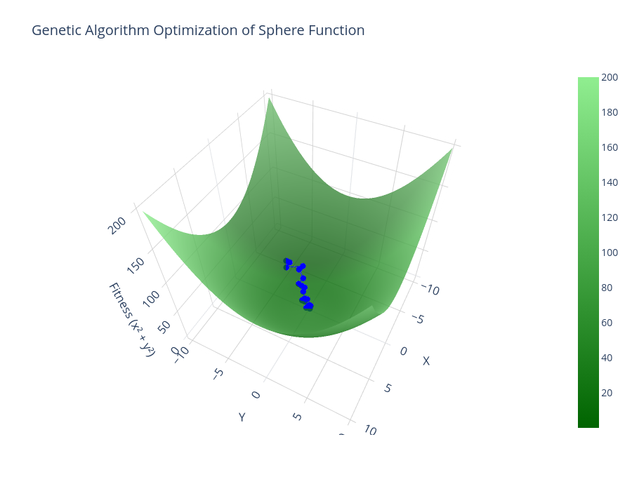
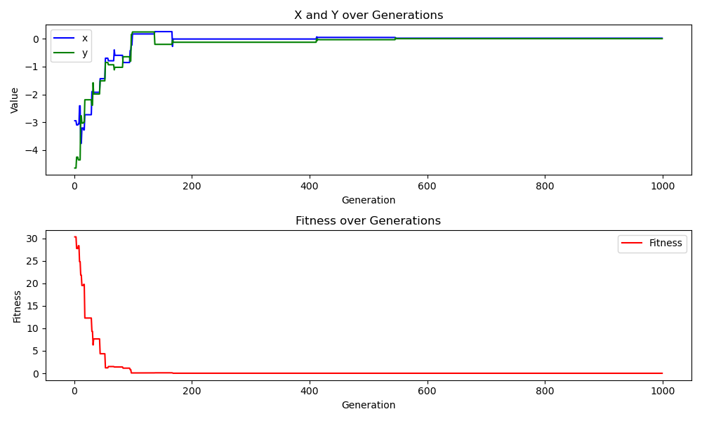

# Sphere Function Optimization using Genetic Algorithm

## Overview
This project implements a **Genetic Algorithm (GA)** to optimize the **Sphere function**:

\[ f(x, y) = x^2 + y^2 \]

The algorithm searches for the global minimum of this function within a defined range. The evolution of solutions is visualized using **Plotly 3D plots**.

---

## Features
✅ **Genetic Algorithm Implementation**
- Random initialization of individuals
- Selection, crossover, and mutation operators
- Elitism to preserve the best solutions

✅ **Sphere Function Optimization**
- Finds the minimum of \( f(x, y) = x^2 + y^2 \)
- Uses a population-based search approach

✅ **Scientific Visualization**
- **Green surface** for the Sphere function
- **Blue evolution path** for algorithm progress
- Interactive 3D plot using **Plotly**

---

## Installation & Setup
### **1. Install Dependencies**
Ensure you have **C++** and **Python** installed:
```bash
pip install -r requirements.txt
```

Install missing dependencies using (conda):
```bash
conda env create -f environment.yml
conda activate modernopt
```
---
### **2. Compile & Run the C++ Code**
Compile and execute the **Genetic Algorithm**:
```sh
g++ -o sphere_ga ga_sphere.cpp -O2
./sphere_ga
```
This generates `evolution_data.csv`, which stores **x, y, and fitness values** for visualization.

### **3. Visualize Evolution Using Python**
Run the Python script to generate the **plots**:
```sh
python ga_sphere_plotter.py
```

---
This plot shows how the **best fitness value improves in 3D space** over generation.

This plot shows how the **best fitness value improves in 2D space** over generation.


## Example Output
### **C++ Console Output**
```
[INFO] Generation 200 Best: (0.00231, -0.00154) Fitness: 0.000008
[DONE] Best solution found: (0.00098, -0.00067) with fitness: 0.000002
```

### **3D Visualization (Plotly)**
The **Sphere function (green surface)** and the **evolution path (blue dots & lines)** are plotted.

---

## Author
**Eng.Ahmed .M Abdelgaber**

---

## License
This project is licensed under the MIT License.

