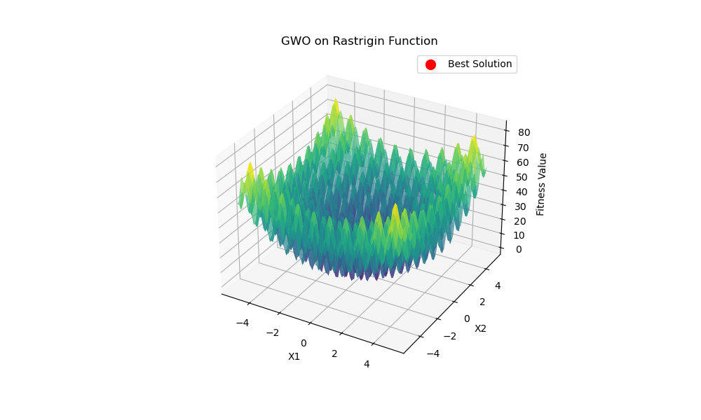
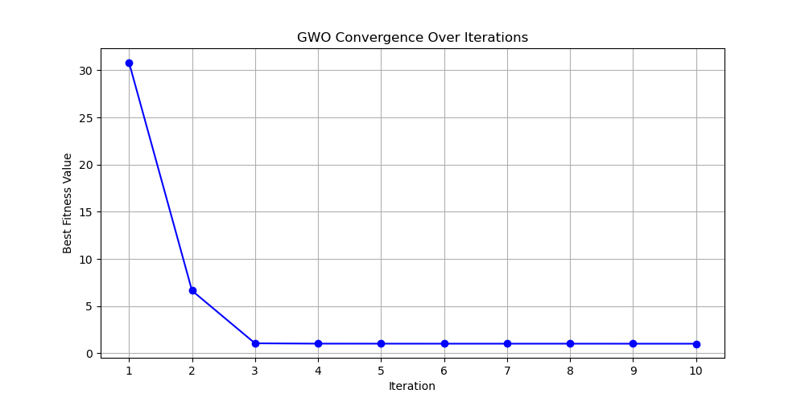

# **Grey Wolf Optimizer (GWO) for Rastrigin Function**

This repository implements the **Grey Wolf Optimizer (GWO)** to minimize the **Rastrigin function**, a common benchmark function for testing optimization algorithms. The script visualizes both the **convergence of the best fitness** and the **3D plot of the Rastrigin function** with the optimal solution found.

## **Table of Contents**
- [Introduction](#introduction)
- [Requirements](#requirements)
- [How It Works](#how-it-works)
- [Usage](#usage)
- [Results](#results)
- [References](#references)

## **Introduction**
Grey Wolf Optimizer (GWO) is a **metaheuristic algorithm** inspired by the **hunting behavior of grey wolves**. It mimics the hierarchical structure and cooperative hunting strategies of wolves to find optimal solutions.

In this project, GWO is applied to **minimize** the **Rastrigin function**, which is defined as:

<!DOCTYPE html>
<html lang="en">
<head>
    <meta charset="UTF-8">
    <meta name="viewport" content="width=device-width, initial-scale=1.0">
    <title>Styled MathML Equation</title>
    <style>
        body {
            font-family: "Arial", sans-serif;
            text-align: center;
            background-color: #f4f4f4;
            padding: 20px;
        }
        .math-container {
            display: inline-block;
            padding: 20px;
            background: white;
            border-radius: 10px;
            box-shadow: 0px 4px 10px rgba(0, 0, 0, 0.2);
        }
        math {
            font-size: 24px;
            color: #333;
        }
    </style>
</head>
<body>

    <h1>Stunning Mathematical Equation</h1>
    
    <div class="math-container">
        <math display="block">
            <mi>f</mi><mo>(</mo><mi>x</mi><mo>)</mo>
            <mo>=</mo>
            <mn>10</mn><mi>n</mi>
            <mo>+</mo>
            <munderover>
                <mo>&sum;</mo>
                <mrow>
                    <mi>i</mi><mo>=</mo><mn>1</mn>
                </mrow>
                <mi>n</mi>
            </munderover>
            <mrow>
                <mo>[</mo>
                <msup>
                    <mi>x</mi>
                    <mn>2</mn>
                </msup>
                <mo>-</mo>
                <mn>10</mn>
                <mo>cos</mo>
                <mo>(</mo>
                <mn>2</mn><mi>&pi;</mi><mi>x</mi>
                <mo>)</mo>
                <mo>]</mo>
            </mrow>
        </math>
    </div>

</body>
</html>

This function has a **global minimum at (0,0,...,0) with a value of 0** and contains **many local minima**, making it challenging for optimization.

---

## **Requirements**
Ensure you have the following installed:

- Python 3.x
- NumPy
- Matplotlib
- plotly
Install missing dependencies using (pip):

```bash
pip install -r requirements.txt
```

Install missing dependencies using (conda):
```bash
conda env create -f environment.yml
conda activate modernopt
```
---

## **How It Works**
1. **Initialize Wolves** 🐺  
   The algorithm starts with a **randomly initialized population of wolves** within the search space.

2. **Update Position**  
   Wolves **update their positions** based on the three best solutions: **Alpha (leader), Beta, and Gamma wolves**.

3. **Convergence**  
   Over multiple iterations, wolves **move towards the optimal solution** while maintaining **exploration and exploitation**.

4. **Visualization**  
   - A **3D plot** of the **Rastrigin function** with the best solution.  
   - A **convergence plot** showing the **best fitness value per iteration**.

---

## **Usage**
Run the script using:

```bash
python gwo.py
```

This will:
- **Run the GWO algorithm** on a **3D Rastrigin function**.
- **Plot the optimization process** and **convergence curve**.
- **Display the best solution found** and its **fitness value**.

---

## **Results**
After running the script, you will see two plots:

### **1️⃣ 3D Rastrigin Function with Best Solution**
This plot visualizes the Rastrigin function and marks the **best solution found**.



### **2️⃣ Fitness Convergence Over Iterations**
This plot shows how the **best fitness value improves** over iterations.



---

## **References**
- **S. Mirjalili, S. M. Mirjalili, and A. Lewis**,  
  "Grey Wolf Optimizer," *Advances in Engineering Software, 2014*  
- **Rastrigin Function**: https://en.wikipedia.org/wiki/Rastrigin_function

---

### **🚀 Happy Optimizing!**
